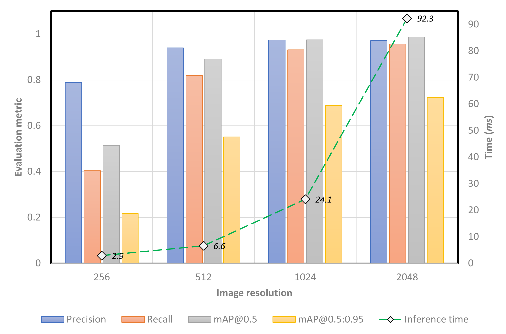
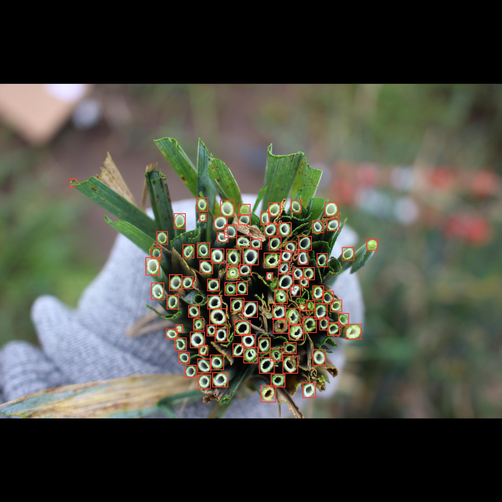
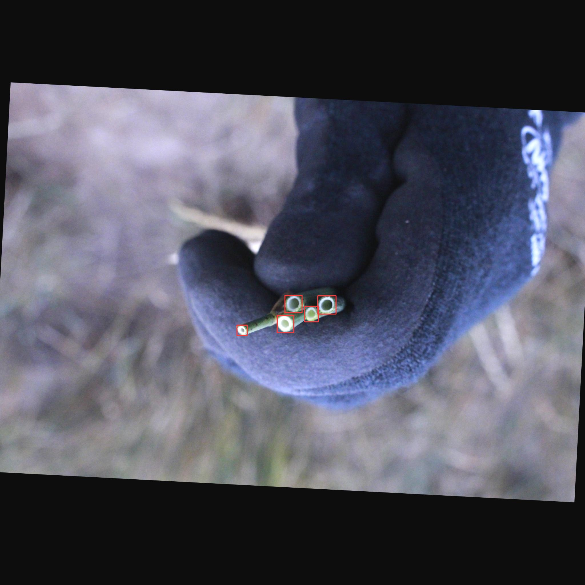

# Kernza Stem Detection
This repository describes the process of developing a Kernza stem detection/counting model using [YOLOv8](https://github.com/ultralytics/ultralytics) and [Ilastik](https://www.ilastik.org/).

## METHOD 1: Using YOLOv8
This method uses the [YOLOv8](https://github.com/ultralytics/ultralytics) model to detect and count Kernza stems in images. The dataset used to train this model can be found on [Roboflow](https://roboflow.com/).

### Getting Started
- Clone this repository to your local machine:
```bash
git clone https://github.com/collinswakholi/Kernza_stems_detection.git
cd Kernza_stems_detection
```
- Install the requirements:
```bash
pip install -r requirements.txt
```
- Download the dataset from Roboflow (using [this link](https://universe.roboflow.com/usdaars/kz_measurestems)) and extract it into the `"Data"` folder of this repository. Rename the folder containing the images and labels to `"img_size"` depending on the image size of your dataset. For example, if your image size is `512x512`, rename the folder to `"512"`. 
The folder structure should look like this:
```bash
Kernza_stems_detection
├── Data
│   ├── 512
│   │   │  ├── train
│   │   │  │   ├── images
│   │   │  │   ├── labels
│   │   │  ├── data.yaml
│   │   │  ├── README.roboflow.txt
│   │   │  ├── README.dataset.txt
├── utils
│   ├── do_shuffle.py
│   ├── shuffle_write.py
├── imgs
├── inference.py
├── Inference.ipynb
├── train_YOLOv8.py
├── README.md
├── requirements.txt
```
- Edit the `data.yaml` file in the `"Data/img_size"` folder to match your dataset. The `data.yaml` file should look like this:
```bash
train: ../train/images
val: ../valid/images
test: ../test/images

nc: 1
names: ['stems']

roboflow:
  workspace: usdaars
  project: kz_measurestems
  version: 17
  license: CC BY 4.0
  url: https://universe.roboflow.com/usdaars/kz_measurestems/dataset/17

```

### Training
- First, open the `train_YOLOv8.py` file and edit the `img_sz` variable to match your dataset.

- Edit the training parameters in the `train_YOLOv8.py` file to suit your needs. 
```bash
# set training parameters
project = 'kernza_stems'
name = 'yolov8_model_'+str(img_sz)+'_'
data = yaml_dir
imgsz = img_sz
epochs = 500
batch = -1 # 2, 4, 8, 16, 32, 64, 128, 256 # batch size or -1 for auto (largest batch size possible)
optimizer = 'Adam' # 'SGD', 'Adam', 'AdamW', 'RMSprop', 'RAdam', 'Adamax', 'auto'
device = '0' # '0,1,2,3,4,5,6,7' # cuda device, i.e. 0 or 0,1,2,3 or cpu
patience = 100 # early stopping patience
verbose = True # print mAP every epoch
exist_ok = True # change to true if you want to overwrite previous results
name_val = name+"_val" # validation results
single_cls = False # train as single-class dataset
cache = True # use cache images for faster training
```
- You can also edit the ratio of the training, validation, and test sets in the `utils/shuffle_write.py` file. The default ratio is `0.7:0.2:0.1` for training, validation, and test sets respectively. This will create a new shuffled dataset in the `"Data/img_size_shuffled"` folder which will be used for training.
```bash
self.ratio = [0.7, 0.2, 0.1] # train, val, test
```

- Run the `train_YOLOv8.py` file to start training:
```bash
python train_YOLOv8.py
```
- The training results will be saved in the `"project/name"` folder. The best model will be saved in the `"project/name/weights"` folder.

### Inference
- Download the stem count model artefacts from [Google Drive](https://drive.google.com/drive/folders/1VLQkowfidxsOjknyZr7Up9Ks8omRDjnm?usp=sharing).
- To run inference on images in a folder, open the `inference.py` or `inference.ipynb` if you are using Colab.  Edit the variables to match your dataset and model directory.
```bash
img_sz = 2048

image_folder = '/RawImages/AkronTest_CO' # change this to the path of your images

base_folder = '_'.join(image_folder.split('/')[-2:])

# set inference parameters
name = 'yolov8_model_'+str(img_sz)+'_Images_'+base_folder
project = 'YOLOResults'
save = True # save image results  ######################################################################
save_txt = False # save results to *.txt
save_conf = False # save confidences in --save-txt labels
show_labels = False   # hide labels
show_conf = False # hide confidences
line_width = 2
batch = -1 # batch size
visualize = False # visualize model features
conf_thres = 0.28 # confidence threshold
iou_thres = 0.55 # NMS IoU threshold
imgsz = img_sz # inference size (pixels)
exist_ok = True # if True, it overwrites current 'name' saving folder #####################################
half = True # use FP16 half-precision inference True/False
cache = True # use cache images for faster inference

img_fmt = '.JPEG' # image format
```
- You can run inference on a subset of the images in the folder by editing the `nx` variable. The default is `nx = 10` which runs inference on batches of 10 images in the folder. Depending on how big the model is, amount of available VRAM, and the number of images in the folder, you can increase or decrease this value.
```bash
# split the list of images into batches of 10 images
nx = 10 # number of images per batch
```
- Run the `inference.py` file to start inference:
```bash
python inference.py
```
- The results will be saved in the `"project/name"` folder, including the stems count in the `"project/name/stem_count_img_size.csv"` file. 
- The same can be done using the `Inference.ipynb` notebook on Google Colab.

### Results
- Performance of the model on the test set:

- Example of the model's predictions on images


## METHOD 2: Using Ilastik
 Check out these videos that explain how stem detection was done using [Ilastik](https://www.ilastik.org/).

 - Ilastik Pixel Classification Video (1/2)
 [](https://www.youtube.com/watch?v=gnbqtwN2Zsc)

 - Ilastik Pixel Classification Video (2/2)
 [](https://www.youtube.com/watch?v=VVntpw4AO9Q)

